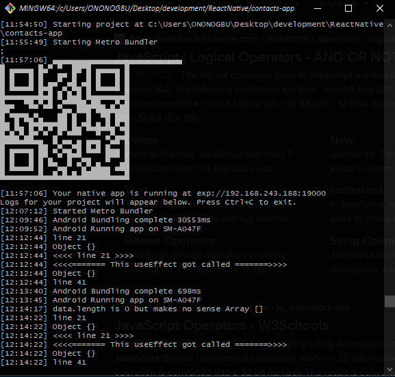
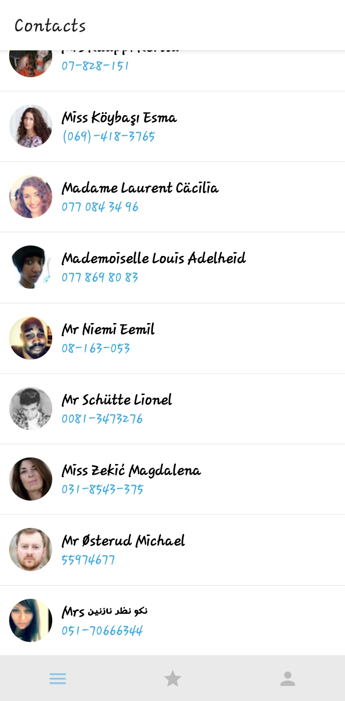
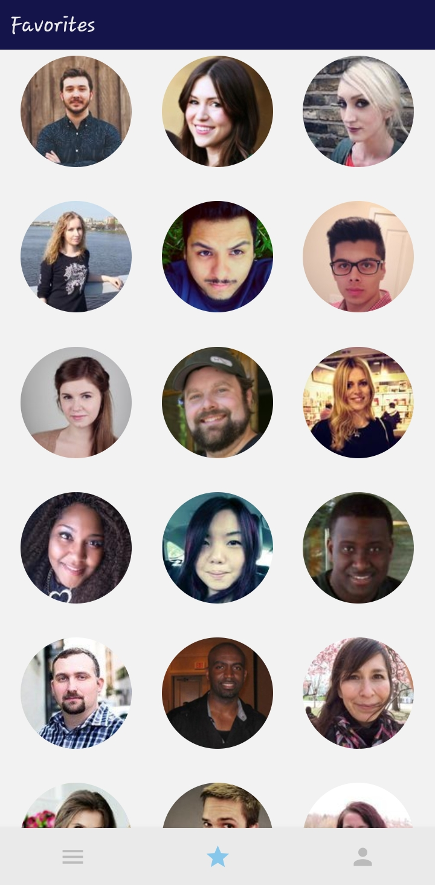
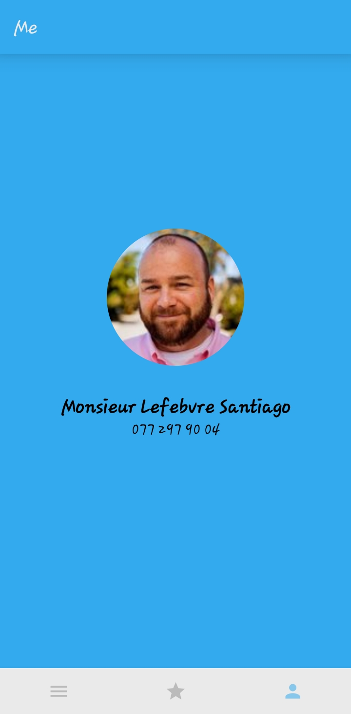
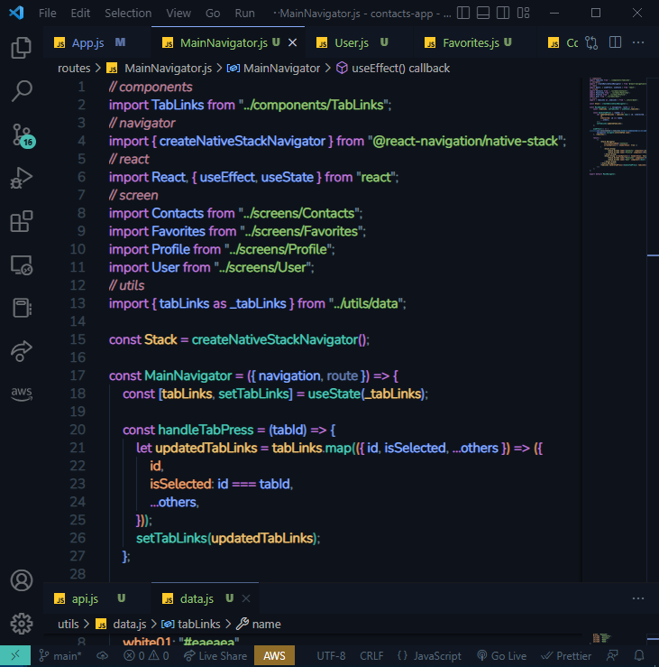

# Contacts App 📔

### Table of Contents

-   [Description](#description)
    -   [Technologies Used](#technologies-used)
-   [Cloning and Installation](#cloning-and-installation)
    -   [Cloning the repository](#cloning-the-repository)
    -   [Installing the app](#installing-the-app)
    -   [Issues & Errors](#issues--errors)
-   [Screenshots](#screenshots)
-   [Developer](#developer)

## Description

This is a mobile application that uses [contacts API](https://randomuser.me) to generate contact(s) in the 3 screens (Contact, Favorites and User screens).

#### Technologies Used ⚙

-   **[React Native](https://reactnative.dev)**
    React Native is an open-source UI software framework created by Meta Platforms, Inc. It is used to develop applications for Android, Android TV, iOS, macOS, tvOS, Web, Windows and UWP by enabling developers to use the React framework along with native platform capabilities

-   **[Expo](https://docs.expo.dev)**
    Allows developers to build one project that runs natively on all your user's devices. Go to AppStore (iOS) or PlayStore (Android OS) to install ExpoGo for respective devices.

-   **[Axios](https://www.npmjs.com/package/axios)**
    Axios is a simple promise based HTTP client for the browser and Node.js. Axios provides a simple to use library in a small package with a very extensible interface

## Cloning and Installation 👩‍💻

#### Cloning the repository

Open your favourite terminal and run `git clone https://github.com/E-Zbox/contacts-app`

Change directory to the cloned repository `cd contacts_app`

#### Installing the app

**Pre-requisites**

-   Download and install [Node.js](https://nodejs.org)
-   Confirm installation of npm using the command to check for version.

```bash
$ npm --version
8.19.2
```

-   Run the command `npm install` to install project dependencies and devDependencies.
-   Connect your mobile and local machine to the same Wifi-network
-   `npx expo start` to spin up the expo server
-   On your mobile, install ExpoGo (AppStore for iOS and Google PlayStore for Android)
-   Once the Metro bundler has **started**, scan the provided QR code using the ExpoGo app on your mobile device and view the ready application 🎉🎉🥳
    

#### Issues & Errors

Visit the [Expo documentation](https://docs.expo.dev) for a detailed explanation on installing and running the mobile application

## Screenshots 🖼










### Developer 🧑💻

[Ononogbu Ebenezer](https://twitter.com/E-Zbox)
